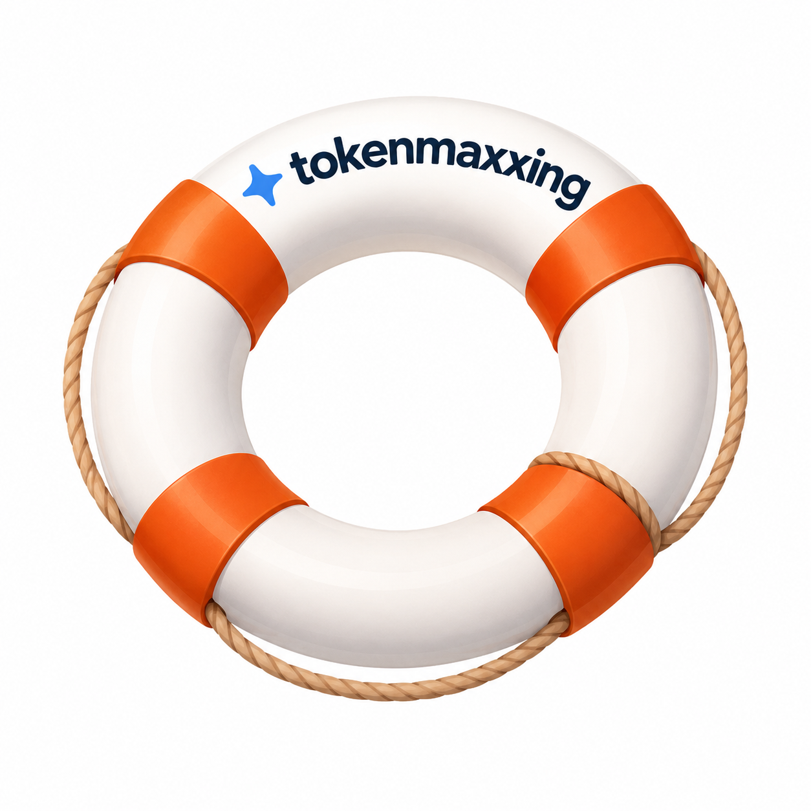

<div align="center">
  
</div>

# SomeGPT Load Testing Toolkit

Automated API discovery, token extraction, and load testing for SomeGPT (NCS GPT platform).

## What This Does

This toolkit helps you:
1. **Extract fresh authentication tokens** automatically from your browser
2. **Test the SomeGPT API** directly (no browser needed)
3. **Run load tests** with parallel sessions to generate traffic
4. **Scale horizontally** for sustained load testing

## Quick Start

### For First-Time Users

**Option 1: Automated Setup (Recommended)**

Run the setup script to install everything:

```bash
# Linux/Mac (WSL)
./scripts/setup.sh

# Windows (PowerShell)
.\scripts\setup.ps1
```

**Option 2: Manual Setup**

```bash
# Install dependencies
npm install

# Install Playwright browser (one-time, ~150MB)
npx playwright install chromium
```

**Linux only:** Install system dependencies
```bash
npx playwright install-deps chromium
```

### Step 1: Extract Fresh Tokens

Tokens expire every ~1 hour, so extract fresh ones before testing:

```bash
npm run extract-tokens
```

**What happens:**
- Opens browser with SomeGPT
- You send any message (e.g., "test")
- Script automatically captures auth tokens
- Saves to `.env.local` (gitignored)

### Step 2: Test API Connection

```bash
npm run test-chat
```

**Expected output:**
```
✅ SUCCESS!
Response: data: [bot] Hello...
```

### Step 3: Run Load Test

**Option 1: Smart Runner (Recommended)**

Automatically validates tokens and extracts fresh ones if needed:

```bash
# Linux/Mac (WSL)
./scripts/run-tests.sh

# Windows (PowerShell)
.\scripts\run-tests.ps1
```

**Option 2: Direct Load Test**

```bash
npm run load-test
```

**Default behavior:**
- Sends 2 requests (Complexity Level 1 & 5 questions)
- 1-minute pause between requests
- 1 concurrent session
- Saves results to `results/` folder

## Configuration

Copy `.env.example` to `.env.local` and fill in your values:

```bash
# Authentication cookie (auto-filled by capture script)
AUTH_TOKEN=your-token-here
API_KEY=your-api-key-here

# API endpoint (REQUIRED - get from `npm run extract-tokens` or browser DevTools)
API_ENDPOINT=https://...

# Conversation ID (use existing or leave blank for auto-gen)
CONVERSATION_ID=a6971918-50ca-455b-b822-13c780bdb05b

# Pause between prompts in minutes
PAUSE_MINUTES=1

# Number of parallel sessions
CONCURRENT_SESSIONS=5

# Test duration (0 = run once, >0 = minutes)
DURATION_MINUTES=0
```

## Understanding Results

### API Test Output

```
SomeGPT API Client
====================

Configuration:
   API Endpoint: https://...
   Cookie length: 245 chars
   Conversation ID: test-conversation

Test 1: Sending API request...
   Endpoint: https://...
   Status: 200 OK
   Duration: 3245ms
   Success!
   Response size: 15234 bytes
   Token usage: { prompt_tokens: 150, completion_tokens: 890, total_tokens: 1040 }
```

### Load Test Summary

```
SomeGPT Load Test
===================

Load Test Summary
====================
Total Sessions: 5
Total Requests: 10
Successful: 10 (100.00%)
Failed: 0
Avg Response Time: 4523.45ms
Total Tokens: 10450
Duration: 6.23 minutes

Results saved to: results/load-test-2026-07-24T12-34-56.json
```

## For Other Users

### Sharing Load Tests with Your Team

**Option 1: Full Setup (They Extract Their Own Tokens)**

Share this repo with your team. They run:

```bash
# One-time setup
./scripts/setup.sh    # Linux/Mac
.\scripts\setup.ps1   # Windows

# Run tests (handles token extraction automatically)
./scripts/run-tests.sh    # Linux/Mac
.\scripts\run-tests.ps1   # Windows
```

**What they need:**
- Node.js v18+
- ~200MB for Playwright browser
- Ability to login to SomeGPT (for token extraction)

**Option 2: Quick Start (You Provide Tokens)**

1. Extract tokens and endpoint on your machine:
   ```bash
   npm run extract-tokens
   ```

2. Share `.env.local` securely (NOT via git):
   - Use secure channel (Teams, email, password manager)
   - Tokens valid for ~1 hour
   - **Important:** Make sure `API_ENDPOINT` is included

3. They run:
   ```bash
   npm install
   npm run load-test
   ```

**What they need:**
- Node.js v18+
- No Playwright/browser dependencies
- Fresh `.env.local` from you (hourly)

### Finding Conversation IDs

- Open SomeGPT conversation in browser
- URL format: `https://SomeGPT.ncs.com.sg/?conversation_id=SESSION-ID`
- Copy the `SESSION-ID` part

## How to Find the API Endpoint

If the API endpoint changes or you need to discover it from scratch, follow these steps:

### Method 1: Browser DevTools (Manual - 5 minutes)

1. **Open SomeGPT in your browser**
   - Navigate to `https://ncsgpt.ncs.com.sg`
   - Login if needed

2. **Open Developer Tools**
   - Press `F12` or `Ctrl+Shift+I` (Windows) / `Cmd+Option+I` (Mac)
   - Go to the **Network** tab
   - Filter by **Fetch** or **XHR**

3. **Capture the API Call**
   - Send any message in the chat (e.g., "test")
   - Look for a request to `/orchestrator/...` or similar path
   - Click on the request

4. **Extract the Details**
   - **URL**: Copy the full endpoint (e.g., `https://.../orchestrator/sk-chat/stream`)
   - **Headers**: Note `Authorization`, `X-API-Key`, `Content-Type`
   - **Request Body**: Copy the JSON payload structure

5. **Update Your Configuration**
   - Paste the new endpoint into `.env.local` as `API_ENDPOINT`
   - Update any changed headers in the test code

### Method 2: Automated Capture Script

If you have the capture script configured:

```bash
npm run capture
```

This will:
- Open a browser automatically
- Guide you through sending a test message
- Extract the endpoint and tokens
- Save everything to `.env.local`

### What Can Change & How to Fix

| Component | How to Detect | How to Update |
|-----------|---------------|---------------|
| **Base URL** (domain) | Network tab shows new domain | Update `API_ENDPOINT` in `.env.local` |
| **Path** (`/orchestrator/...`) | Different path in request | Update endpoint path |
| **Headers** | New/missing headers in request | Update headers in `api-client.ts` or `load-test.ts` |
| **Request Body** | JSON structure differs | Update `ChatRequest` interface in code |
| **Authentication** | Different auth method | Re-run token extraction or update auth logic |

### Quick Validation

After updating the endpoint:

```bash
# Test with a single request
npm run test-chat

# Check for successful response
# Expected: "✅ SUCCESS!" with response data
```

**Note:** The automated capture method (`capture-network.ts`) is the most reliable way to keep endpoints and tokens in sync when the API changes.

### Scaling Load Tests

**For 10 parallel sessions:**
```bash
# Edit .env.local
CONCURRENT_SESSIONS=10

# Run
npm run load-test
```

**For sustained load (30 minutes):**
```bash
# Edit .env.local
DURATION_MINUTES=30

# Run
npm run load-test
```

## Troubleshooting

### "Command not found: ./scripts/run-tests.sh"
Make sure the script is executable:
```bash
chmod +x scripts/run-tests.sh
chmod +x scripts/setup.sh
```

### "Playwright browser not found"
Install the browser:
```bash
npx playwright install chromium
```

### "HTTP 401 Unauthorized"
- Tokens have expired (~1 hour lifetime)
- Re-run `npm run extract-tokens` to get fresh tokens
- Or use the smart runner: `./scripts/run-tests.sh` (auto-refreshes tokens)

### "System dependencies missing" (Linux only)
Install Linux system libraries:
```bash
npx playwright install-deps chromium
```

### "Node.js version too old"
Upgrade to Node.js v18 or higher:
```bash
# Check version
node --version

# Download from https://nodejs.org/
```

### Results Not Showing
Check the results directory:
```bash
ls -lt results/
cat results/load-test-*.json
```
- Check if cookie format is correct in `.env`

### "HTTP 429 Too Many Requests"
- Rate limiting detected
- Increase `PAUSE_MINUTES` in `.env`
- Reduce `CONCURRENT_SESSIONS`

### Tests failing but browser works
- Check User-Agent header matches your browser
- Ensure all required cookies are included
- Verify Referer header format

## 📁 Project Structure

```
totherescue/
├── src/
│   ├── capture-network.ts    # Network interception & cookie extraction
│   ├── api-client.ts         # Direct API testing
│   └── load-test.ts          # Parallel load testing
├── results/                   # Test results (auto-created)
├── .env                       # Configuration (auto-created)
├── .env.example              # Template
├── captured-api-endpoints.json # Captured API data
├── network-traffic.har        # Full HAR file
├── package.json
├── tsconfig.json
└── README.md
```

## 🔐 Security Notes

- **Never commit `.env`** - Contains sensitive auth cookies
- **Rotate cookies regularly** - They may expire or be revoked
- **Use test conversations** - Don't use production conversation IDs
- **Monitor rate limits** - Respect platform usage policies

## 📝 Complexity Levels

### Level 1 (Baseline)
- Multi-step calculation
- Golden ratio, primes, square roots
- ~500-1000 tokens response

### Level 5 (Advanced)
- 5-dimensional analysis:
  1. Matrix determinant
  2. Fibonacci positioning
  3. Prime factorization chain
  4. Temporal calculations
  5. Chaos theory (logistic map)
- ~2000-5000+ tokens response

## 🎓 Learning Resources

- [Playwright Network Interception](https://playwright.dev/docs/network)
- [Node.js Fetch API](https://github.com/node-fetch/node-fetch)
- [Load Testing Best Practices](https://k6.io/docs/)

## 📄 License

MIT

## 🤝 Contributing

1. Fork the repo
2. Create feature branch
3. Add tests
4. Submit PR

---

**Built for:** SomeGPT Load Testing & API Exploration  
**Last Updated:** 2026-07-24
